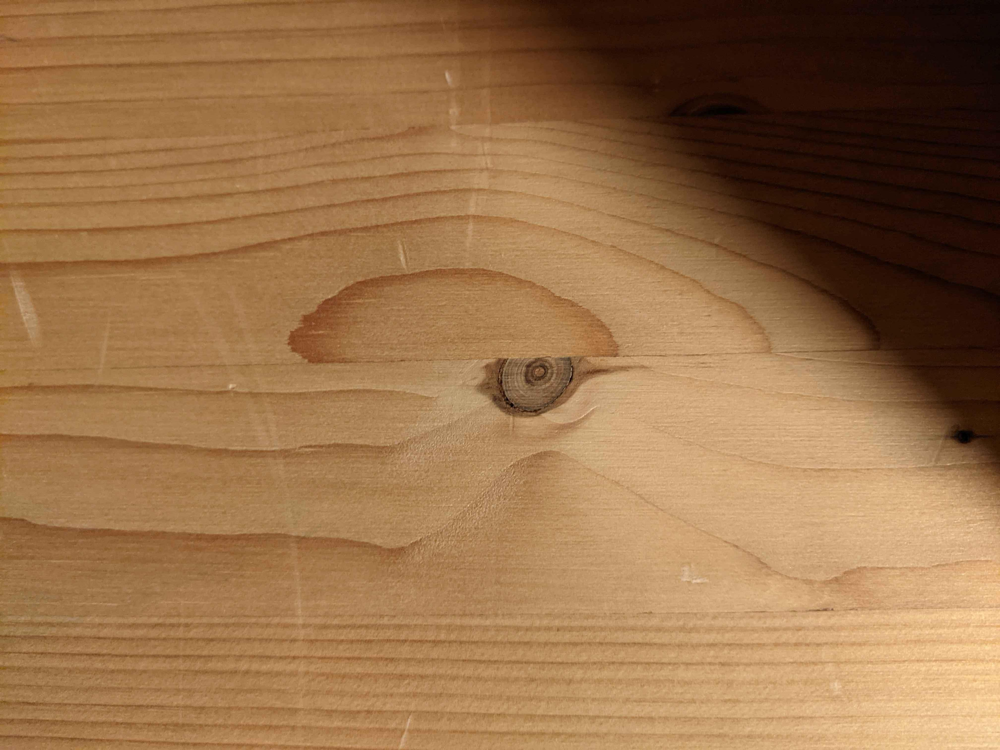
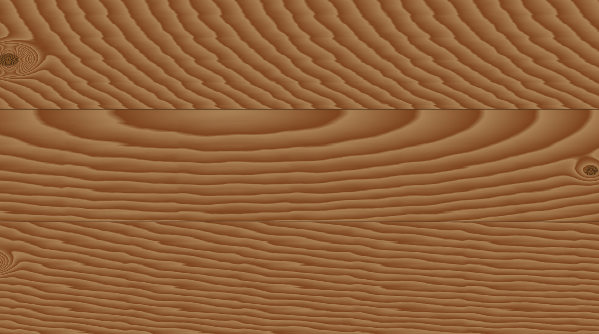
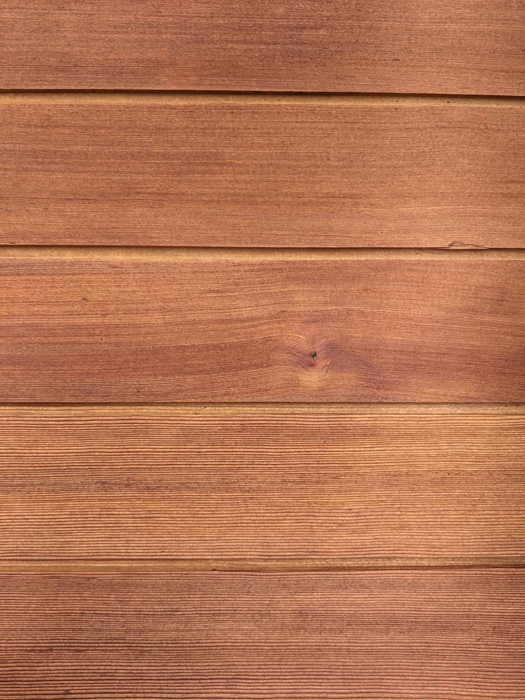
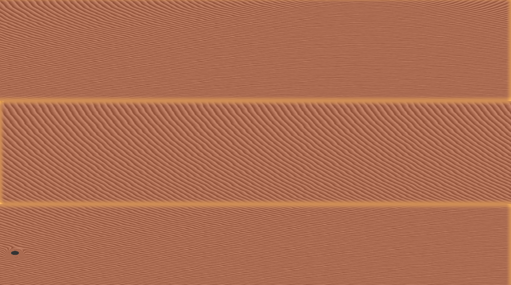
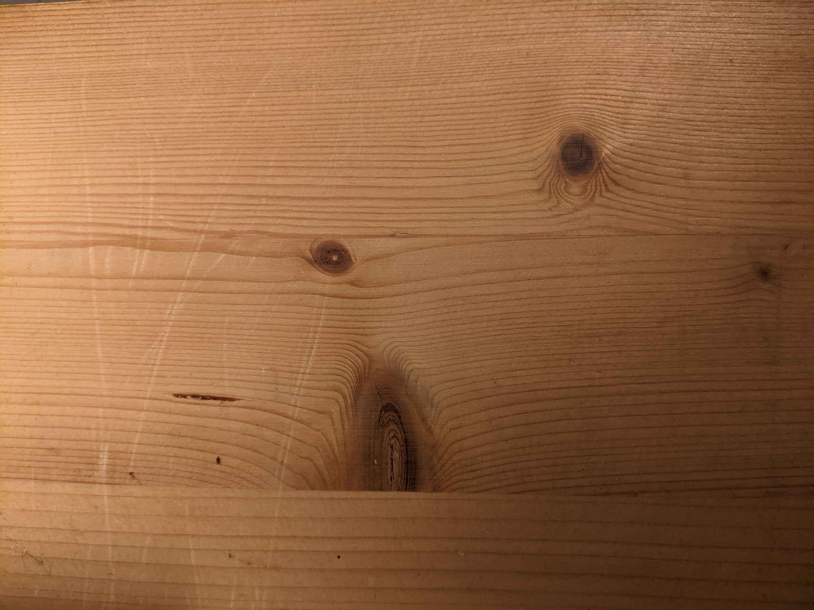
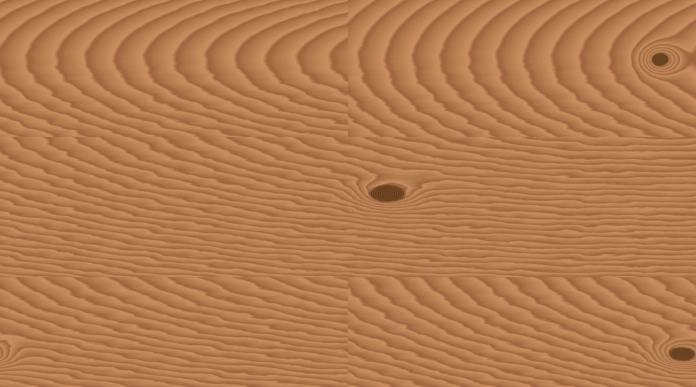
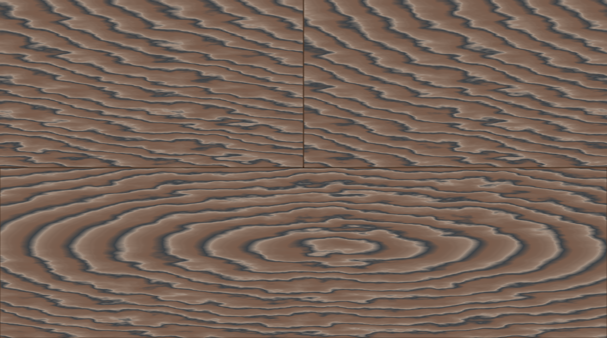
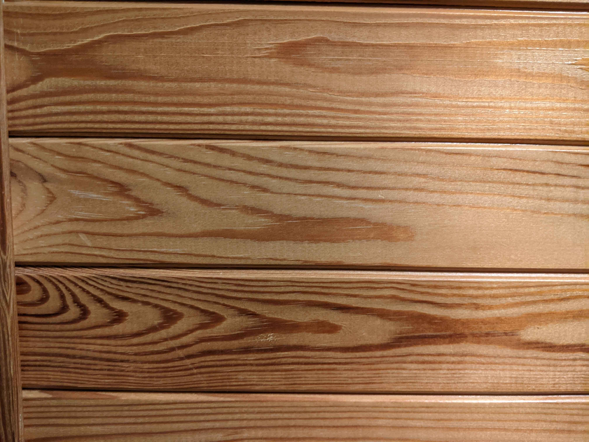
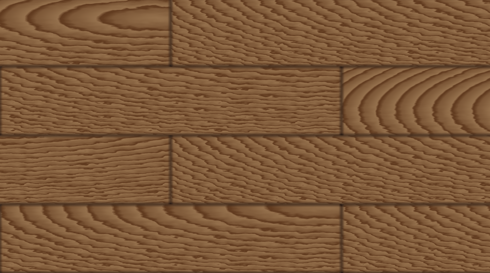

# Project 0 - A shader for hardwood panels

A configurable shader that can represent many kinds of wood panels. This document contains a video showcasing how the shader parameters influence the output and additionally lists 5 examples of how to configure the shader to imitate a photograph of hardwood panels.

<!-- ## Playable version

<iframe src="../export/index.html">
	Can't load iframe
</iframe> -->

## Showcase video

<video width="90%" alt="some colorful animation" controls>
<source src="videos/parameter-showcase.mp4">

</video>

## Examples

Listed are 5 examples of how to configure the shader parameters to imitate a photograph of hardwood panels. Parameters for color gradients and noise textures are not listed, you need to open the godot project to see their settings.

### Example 1

Shader parameters:

| Parameter        | Value      |
| ---------------- | ---------- |
| Planks Num       | (0.5, 3.0) |
| Border Color     | #442e1fc3  |
| Border Thickness | 0.1        |
| Age              | 4.611      |
| Ring Compression | 1          |
| Snarl            | 0.28       |
| Seed             | 0.126      |
| Knot Size        | 0.1        |

### Example 2

Shader parameters:

| Parameter        | Value        |
| ---------------- | ------------ |
| Planks Num       | (0.5, 2.785) |
| Border Color     | #cf8d55      |
| Border Thickness | 1.06         |
| Age              | 76.316       |
| Ring Compression | 0            |
| Snarl            | 0.103        |
| Seed             | 0.234        |
| Knot Size        | 0.035        |

### Example 3

Shader parameters:

| Parameter        | Value        |
| ---------------- | ------------ |
| Planks Num       | (1.0, 2.785) |
| Border Color     | #ffffffff    |
| Border Thickness | 0            |
| Age              | 15.135       |
| Ring Compression | 0.088        |
| Snarl            | 0.321        |
| Seed             | 1            |
| Knot Size        | 0.1          |

### Example 4

Shader parameters:

| Parameter        | Value      |
| ---------------- | ---------- |
| Planks Num       | (1.0, 2.0) |
| Border Color     | #442e1fc3  |
| Border Thickness | 0.45       |
| Age              | 16.026     |
| Ring Compression | 0.053      |
| Snarl            | 0.652      |
| Seed             | 0.947      |
| Knot Size        | 0          |

### Example 5

Shader parameters:

| Parameter        | Value        |
| ---------------- | ------------ |
| Planks Num       | (1.435, 4.0) |
| Border Color     | #442e1fc3    |
| Border Thickness | 2            |
| Age              | 5.518        |
| Ring Compression | 0.807        |
| Snarl            | 0.526        |
| Seed             | 0.295        |
| Knot Size        | 0            |
