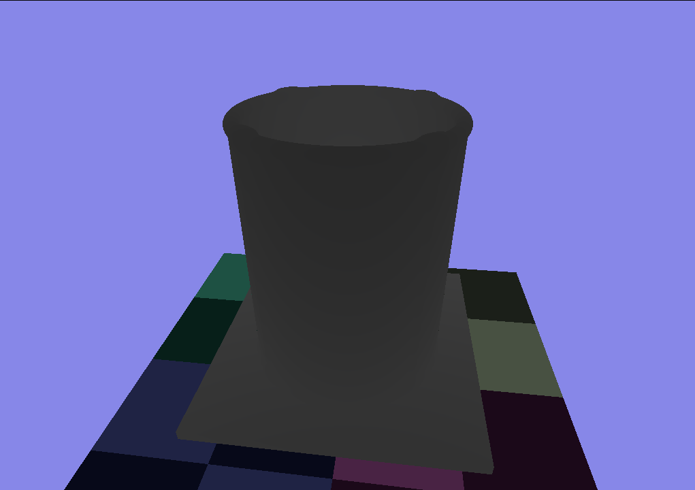
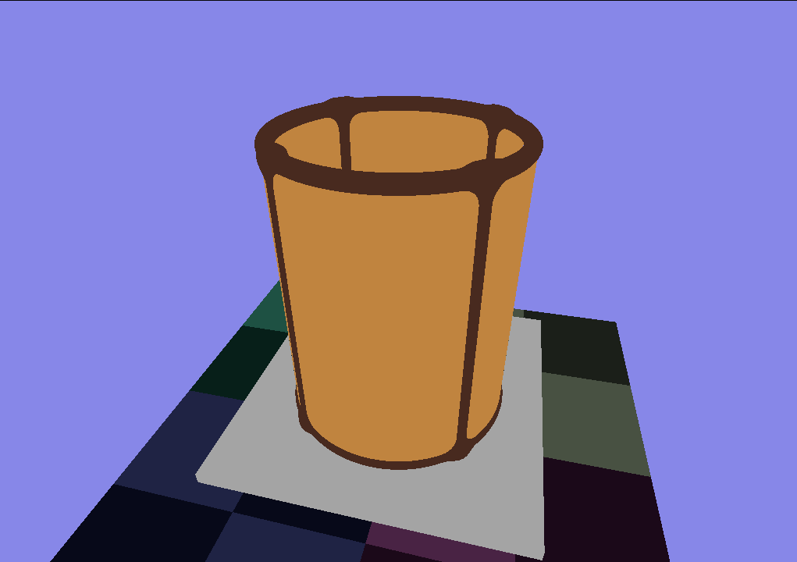
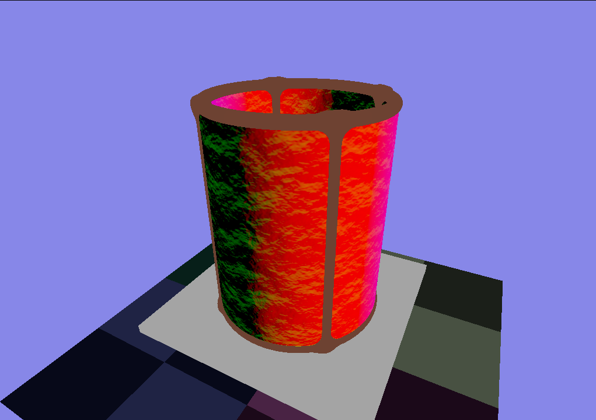
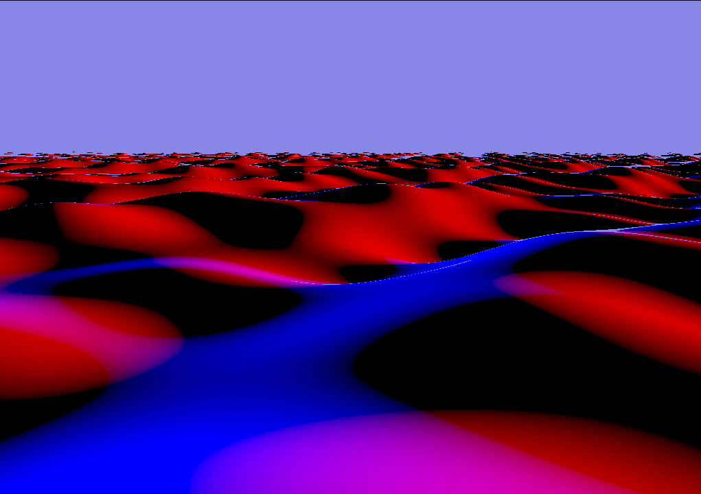
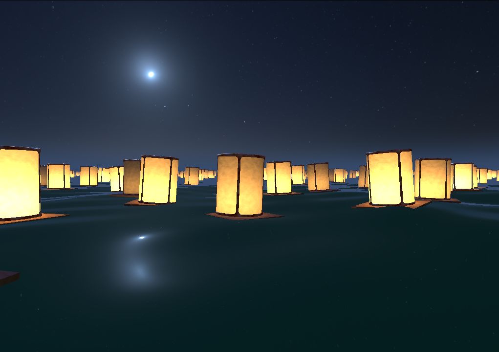
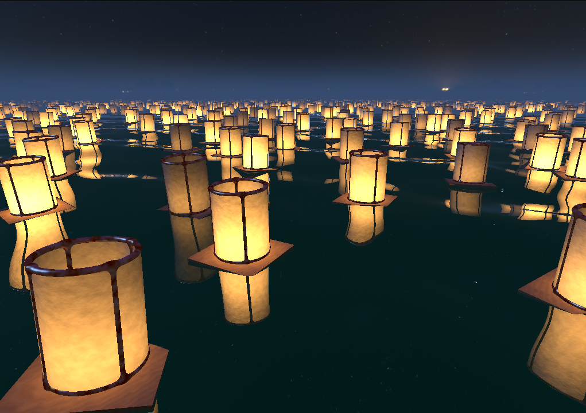

<style>
body {
	max-width: 60em;
	line-height: 150%;
	font-family: sans-serif;
	padding: 1em;
	margin: 0 auto;
}
img, video {
	width: 100%;
	max-width: 512px;
}
iframe {
	width: 100%;
	max-width: 512px;
	height: 256px;
}
pre {
	border: 1px solid black;
	padding: 1em 2em;
}
/* dark mode */
@media (prefers-color-scheme: dark) {
	body {
		color: #cac5be;
		background-color: #181a1b;
	}
	pre {
		border: 1px solid white;
	}
	h1, h2, h3, h4, h5 {
		border-color: rgba(255, 255, 255, 0.48) !important;
	}
	a {
		color: #6eb2ee;
	}
}
</style>

# Project 1 - Paper lantern festival

Floating paper lanterns on a lake created using **ray marching** and **signed distance functions** (SDFs).

## Interactive version

<iframe src="../export/index.html">
	Can't load iframe
</iframe>

## Video recording

<video alt="paper lantern recording" controls>
<source src="videos/recording.mp4">

</video>

## Step by step documentation

### Lantern geometry as SDF



The lantern is composed of multiple parts that all have their inidvidual SDFs: Paper, metal, wood. The SDFs use primitives and operations from [this article](https://iquilezles.org/articles/distfunctions/).

```GLSL
float sdfPaper(vec3 p) {
	p -= vec3(0,-1,0);

	float box = sdBox(p - vec3(0,4.0,0), vec3(2.0));
	float cylinder = sdCappedCylinder(p - vec3(0,1.5,0), 1.5, 0.75);
	float cylinder_boundary = opOnion(cylinder, 0.03);
	return opSubtraction(box, cylinder_boundary);
}

float sdfWood(vec3 p) {
	p.y += 1.0;
	return sdBox(p, vec3(1.1, 0.04, 1.1));
}

float sdfMetal(vec3 p) {
	p -= vec3(0,-1,0);

	float torus1 = sdTorus(p + vec3(0,-0.08,0), vec2(0.75, 0.05));
	float torus2 = sdTorus(p + vec3(0,-2.0,0), vec2(0.75, 0.05));
	float tori = opUnion(torus1, torus2);

	float cylindri = sdCappedCylinderOffset(opSymXZ(p + vec3(0,-1,0)), 1.03, 0.05, vec2(0.75 * 0.707));

	return opSmoothUnion(cylindri, tori, 0.1);
}
```

### Transparent and opaque parts



The different parts are shaded differently. To distinguish between them while shading the SDFs of the indiviual components are evaluated again to check which shading function should be used.

```GLSL
float dPaper = sdfPaper(p);
float dWood = sdfWood(p);
float dMetal = sdfMetal(p);

bool isMetal = dMetal < dPaper && dMetal < dWood;
bool isPaper = dPaper < dMetal && dPaper < dWood;

if (isMetal) {
	return shadeMetal(...);
}
else if (isPaper) {
	return shadePaper(...);
}
else {
	return shadeWood(...);
}
```

### Surface appearance



To create a spatially variant surface appearance of the paper, a normal map is sampled and used to offset the normals of the surface. The resulting normal can be seen in the image above. Additionally, a simple noise map is sampled to change the albedo color of the paper. To sample these textures cylindrical UV coordinates are calculated.

```GLSL
vec2 calcCylindricalUVs(vec2 dir, vec3 p) {
	float longitude = atan(-dir.y, dir.x); // [-pi;pi]
	return vec2(
		(longitude / 3.141) * 0.5 + 0.5,
		(p.y * 0.5) + 0.5
	);
}
```

The sampling of the normal map does not yield a correct normal, but the visual result looks good, so this method is fine. Correct normal map sampling would be more complicated.

```GLSL
vec2 normalXZ = normalize(vec2(p.x, p.z));
vec2 uv = calcCylindricalUVs(normalXZ, p);

vec3 normalNoise = texture(normal_noise_texture, uv * vec2(2,1)).xyz;
normalNoise = normalNoise * 2.0 - 1.0;

float noise = texture(noise_texture, uv * vec2(2,1)).x;

normal = normalize( normal + normalNoise * 0.35 );
albedo *= 1.0 - noise * 0.4;
```

### Lighting


All materials (paper, metal, wood) have two types of shading: the shading from a directional light (the moon) and the shading from a point light (the candle). Lambertian reflection and the Phong reflection model are used.

The lighting of the candle on the paper uses lambertian shading and takes the distance to the point light into account:

```GLSL
vec3 l = normalize(lightPos - p);
float d = distance(lightPos, p);
float nDotL = dot(normal, l);
float lighting = nDotL * lightStrength / (d*d);
vec3 light = abs(lighting) * lightColor;
```

### Light flickering


To simulate soft light flickering the sum of multiple sin waves with different amplitudes and frequencies are used:

```GLSL
float flickerValue =
	  (cos( TIME * 2.0 * PI) + 2.0) * 0.15
	+ (cos( TIME * 3.0 * PI) + 1.0) * 0.1
	+ (cos( TIME * 2.5 * PI) + 1.0) * 0.1;
lightStrength *= mix(0.3, 0.8, flickerValue);
```

### Irregular repetition


When creating an SDF of infinitely many SDFs that are not symmetric, one has to take special care as explained in [this article](https://iquilezles.org/articles/sdfrepetition/). Every one of our lanterns has a unique offset (acquired by sampling a blue noise texture), so they are not symmetric. Code from the article above has been taken and modified to fit these needs:

```GLSL
float repeated( vec3 p3 ) {
	vec2 p = p3.xz;
	vec2 id = round(p/gridSize);
	vec2  o = sign(p-gridSize*id); // neighbor offset direction

	float d = 1e20;
	for( int j=0; j<2; j++ )
	for( int i=0; i<2; i++ ) {
		vec2 rid = id + vec2(float(i),float(j))*o;
		vec4 blueNoise = blueNoiseAtID(rid);
		vec2 rCenterPos = gridSize*rid - offset(blueNoise.xy);
		vec2 r = p - rCenterPos;
		d = min(d, sdf(vec3(r.x, p3.y, r.y)));
	}
	return d;
}
```

The repetition was also taken into account when shading the lantern.

### Lake surface



To create a lake surface a plane SDF from [this article](https://iquilezles.org/articles/distfunctions/) was used and displaced. The displacement is a sum of sine waves in different directions, with different amplitudes and frequencies.

The image shows the water with an increased height for showcase purposes. It is shaded using the x and z direction of its normals.

```GLSL
float waterHeightAt(vec2 p) {
	vec2[] dirs = { // normalized
		vec2(-0.371391, 0.928477),
		vec2( 0.0, -1.0),
		vec2(-0.624695, 0.780869),
		vec2(-0.768221, -0.640184),
		vec2(0.371391, 0.928477)
	};
	float displacement = 0.0;
	float a = 0.15;
	float w = 0.4;
	for (int i = 0; i < 5; i++) {
		a *= 0.6;
		w *= 1.4;
		vec2 dir = dirs[i];
		float dxz = dot(dir, p);
		displacement += a * sin(dxz * w);
	}
	return displacement;
}

float sdfWater(vec3 p) {
	return sdPlane(p, vec3(0,1,0), 1.0) + waterHeightAt(p.xz);
}
```

### Animated lake


To animate the lake over time, the `TIME` variable was included in the displacement calculation:

```GLSL
displacement += a * sin(
	dxz * w + TIME * 2.5
);
```

### Sky reflections in the lake


[This HDRI map](https://polyhaven.com/a/kloppenheim_02) (CC0) was used and slightly modified using the image manipulation software GIMP. Height based fog was added to the environment shading.

```GLSL
vec3 sky(vec3 dir) {
	dir = normalize(dir);
	float fog = clamp(mix(1, -1.5, dir.y),0,1);
	fog = smoothstep(0,1,fog);
	fog = pow(fog, 15.0);
	float thetaa = acos(dir.y);
	float phii = atan(dir.z, dir.x);
	return mix(
		texture(environment, vec2(phii/TAU, thetaa/PI)).rgb,
		_colorD, fog);
}
```

To create reflections in the lake the ray is reflected from the water surface and used for the environment shading.

```GLSL
Ray reflectedRay = Ray(p, reflect(ray.dir, normal)); // reflect from water surface
return sky(reflectedRay.dir) * waterReflectionStrength + waterColor;
```

### Move lanterns with lake



To adjust the height of the lanterns to match the height of the surface, the `waterHeightAt` function is used when determining the position of the lantern. Additionally, the lantern is rotated based on the normal of the water surface. However, the normal is not calculated accurately, but only the biggest sin wave that is used to create the wave displacement is taken into account. This results in a more natural motion and also improves performance as it is evaluated multiple times for every ray marching step.

```GLSL
float waterHeightRoughAt(vec2 p) {
	float a = 0.15;
	float w = 0.4;
	vec2 dir = vec2(-0.371391, 0.928477); // normalized
	float dxz = dot(dir, p);
	return a * sin(dxz * w + (TIME-0.2) * 2.5);
}

float sdfWaterRough(vec3 p) {
	return sdPlane(p, vec3(0,1,0), 1.0) + waterHeightRoughAt(p.xz);
}

vec3 gradientWaterRough(vec3 p) {
	const vec3 dx = vec3(GRADIENT_DT, 0.0, 0.0);
	const vec3 dy = vec3(0.0, GRADIENT_DT, 0.0);
	const vec3 dz = vec3(0.0, 0.0, GRADIENT_DT);
	return vec3( (sdfWaterRough(p + dx) - sdfWaterRough(p - dx)) / (2.0 * GRADIENT_DT),
				 (sdfWaterRough(p + dy) - sdfWaterRough(p - dy)) / (2.0 * GRADIENT_DT),
		 		 (sdfWaterRough(p + dz) - sdfWaterRough(p - dz)) / (2.0 * GRADIENT_DT)
	);
}
```

### Lantern reflections in the lake



To reflect the lantern on the lake, the reflected ray that was mentioned in "Sky reflections in the lake" is used to start another ray marching process.

```GLSL
Ray reflectedRay = Ray(p, reflect(ray.dir, normal)); // reflect from water surface
vec3 rp = p;
if (!march(reflectedRay, rp)) { // no lantern hit - shade water
	return sky(reflectedRay.dir) * waterReflectionStrength + waterColor;
}
else { // lantern hit
	return shadeLanterns(...);
}
```
