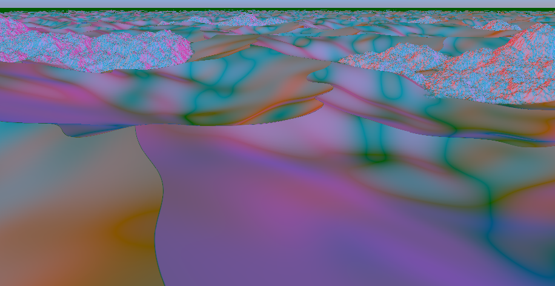

<style>
body {
	max-width: 60em;
	line-height: 150%;
	font-family: sans-serif;
	padding: 1em;
	margin: 0 auto;
}
img, video {
	width: 100%;
	max-width: 512px;
}
iframe {
	width: 100%;
	max-width: 700px;
	height: 400px;
}
pre {
	border: 1px solid black;
	padding: 1em 2em;
}
/* dark mode */
@media (prefers-color-scheme: dark) {
	body {
		color: #cac5be;
		background-color: #181a1b;
	}
	pre {
		border: 1px solid white;
	}
	h1, h2, h3, h4, h5 {
		border-color: rgba(255, 255, 255, 0.48) !important;
	}
	a {
		color: #6eb2ee;
	}
}
</style>

# Project 2 - Weather in the desert

## Interactive version

<iframe src="../export/index.html">
	Can't load iframe
</iframe>

Look around: Left click + move mouse
Walk: `W`, `A`, `S`, `D`
Change height: `Shift`, `Ctrl`
Change daytime: `1` (sunrise), `2` (day), `3` (sunset), `4` (night)

## Video recording

<video alt="desert day cycle recording" controls>
<source src="videos/recording.webm">

</video>

## Step by step documentation

### Geometry


The desert geometry is constructed with a smooth union between two plane SDFs displaced by the height of the terrain. SDF functions and operations are taken from [this article](https://iquilezles.org/articles/distfunctions/). The height is calculated by two height functions, one for the sand and one for the rocks. Both use noise functions from [this WebGL noise library](https://github.com/stegu/webgl-noise/tree/master).

```GLSL
float sd_sand = sdPlane(p, vec3(0,1,0), -sand_height);
float sd_rock = sdPlane(p, vec3(0,1,0), -rock_height);
float sd = opSmoothUnion(sd_sand, sd_rock, 5.0);
```

### Height contour lines


For debugging purposes height contour lines and an orthographic camera were implemented. They can be enabled with the variables `ORTHO_VIEW` and `SHOW_HEIGHT_CONTOUR_LINES` in the shader.

### Normal visualization



To visualize the normal of the terrain, a normal visualization mode can be enabled that illuminates the terrain with five directional lights from the directions x, -x, z, -z and -y.

When looking at a sphere, we can see why this works as a normal visualization:


The colors for the light in x and -x directions are red and pink. We can see that the parts where the normal points in the x direction are shaded red while at the locations the normal points in the -x direction they are shaded pink. Where the normal points to the top (y), the shading is green. The same goes for the z and -z directions, which are illuminated as dark blue and bright blue.

### Texturing


The terrain is shaded using a sand and a rock texture from [Polyhaven](https://polyhaven.com/).

To determine which texture to use at what location, the distance to the individual SDFs (sand and rock) is used.

In addition, at the mountain the rock and send texture are blended based on the terrains normal to give the impression that some sand is sitting on top of the rock.

```GLSL
float t = remap(0.5, 0.9, 0.0, sand_on_rock_amount, normal.y);
t = clamp(t, 0, sand_on_rock_amount);
vec3 rock_with_sand_albedo = mix(rock_albedo, sand_albedo, t);
```

### Sky and lighting


The sky and the directional light (that represents the sun) adjust automatically based on the time of day, which is an exposed Godot-level variable.


All colors and the bloom effect of the sun are based on gradient textures that represent the color/value gradients over the day. They have been carefully chosen.

The position of the sun is calculated with the following function:

```GLSL
vec3 sun_direction() {
	// 0 (0:00) to TAU (24:00)
	float remapped_time = remap(0.0, 24.0, 0.0, TAU, time_of_day);

	float az = remapped_time; // east and west directions are incorrect but whatever

	// cos wave that is lowest at 0:00, peaks at 12:00 and goes through 0 at sunrise (6:00) and sunset (18:00)
	// peak is 45° or pi/4, which is roughly the maximum altitude at the equator (https://www.suncalc.org)
	float el = -cos( remapped_time ) * PI * 0.25;

	// convert spherical coordinates (azimuth, elevation) to direction
	float x = cos(el) * cos(az);
	float y = sin(el);
	float z = cos(el) * sin(az);
	return normalize(vec3(x,y,z));
}
```

### Participating media

Clouds and fog are implemented.


The clouds are drawn as part of the sky background on a plane at 500m height, which is always above the terrain. They are based on a noise texture and fade out in the distance. The clouds move along the x direction as the day progresses.

The fog is based on [this article](https://iquilezles.org/articles/fog/). It is colored based on the sun direction and color.

The strength of both clouds and fog changes over the course of a day based on a gradient texture:


### Different weather and time of day situations

Four weather and time of day situations have been carefully crafted. They can be blended by pressing `1`, `2`, `3` and `4`.

Morning (6:00) and mid day (12:00):


Evening (18:00) and night (0:00):


