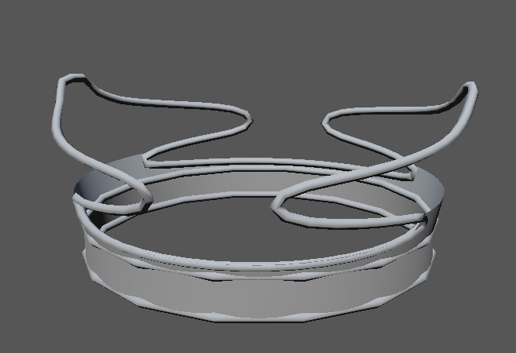
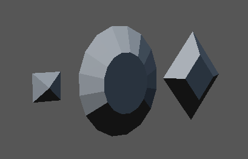
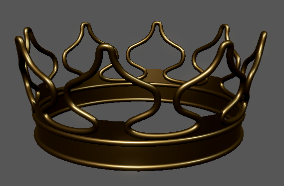
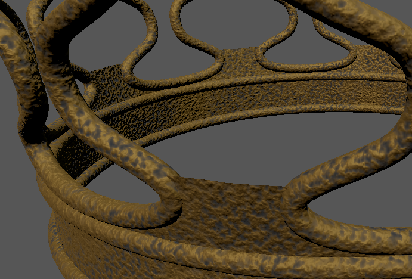
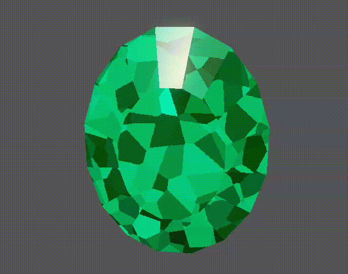
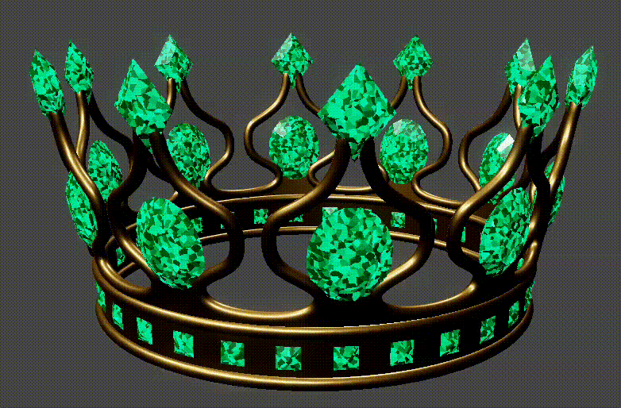
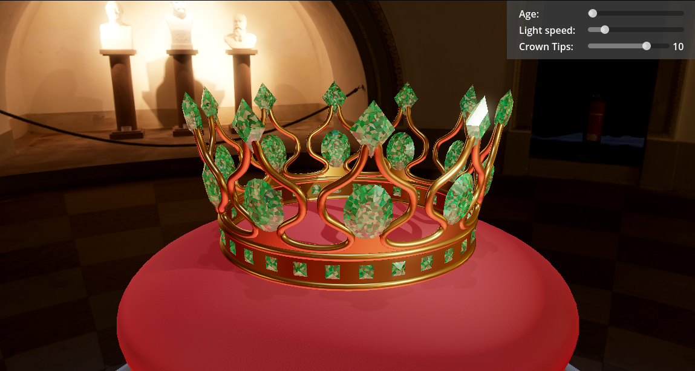

# Project 3 - A crown, old and new

## Interactive Version

<iframe src="../export/index.html">
	Can't load iframe
</iframe>

- Look around: Left click + move mouse
- Zoom: Scroll

## Video Recording

<video alt="recording" controls>
<source src="videos/recording.webm">

</video>

## Step by Step Documentation

### Crown Mesh Generation

The crown mesh consists of multiple parts (from left to right): A curved torus at the top, two torus shapes and a thin flat part. The top part of the mesh is bent slightly outward.

The bent torus follows a Bézier curve defined with the `Path2D` Node in Godot:

The number of tips is configurable as well as the height and the subdivision detail of the mesh.

A crown with reduced subdivision detail and 2 tips:

### Gem Mesh Generation

An algorithm was implemented that can generate different kinds of gems with different parameters. Three gem were created using this algorithm. They have been scaled using the `Node3D`s transform.

The script `mesh_generation.gd` contains the code for the mesh generation of both the gem and the individual crown parts.

### Gem Placement

The script `crown.gd` contains the functions `spawn_gems_top`, `spawn_gems_middle`, `spawn_gems_bottom`, which place the gems.

### Metal Material

A gold material was created by setting according albedo, metallic and roughness values.

### Corroded Metal

The corroded version of the gold material adds normal detail as well as oxidization.

### Gem Material

The shader for the gem fakes details of a gem by doing a refraction along the surface normal. The shader then imitates an infinite plane that lies inside the diamond, which is parallel to the currently viewed surface. A cellular noise texture is mapped onto that plane and used to adjust the color and normal of each cell differently.

Additionally a second material is used using the `next_pass` feature of Godot to render the specular highlights of the actual mesh on top of the "inside" of the gem.

The material is configured to imitate an emerald.

### Corroded Gem

The corroded version of the gem adds normal detail, changes the roughness and adds dirt.

### Aging Process

The corroded versions can be blended to the initial version to simulate the aging process.

### Complete interactive Scene

A scene was created to showcase the meshes and materials:

- A [HDRI from Polyhaven](https://polyhaven.com/a/sepulchral_chapel_basement) is used as background.
- Bloom is enabled.
- The crown was placed on a red pillow.
- A spotlight rotates around the crown and illuminates it.
- A weak directional light shines from the top.
- Both lights cast shadows using Godots shadow mapping capabilities.
- A `ReflectionProbe` is placed in the center of the crown to approximate reflections.
- UI elements are available to change the speed of the spotlight, the age of the crown and the number of tips on the crown.
- The camera can be controlled using the mouse.

