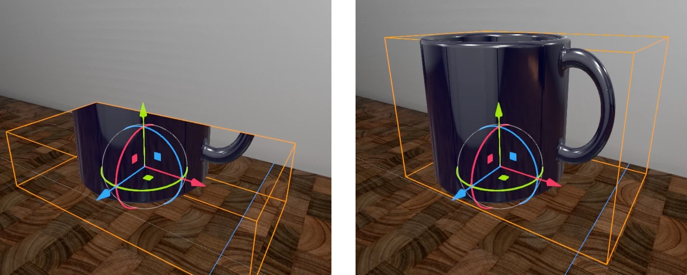
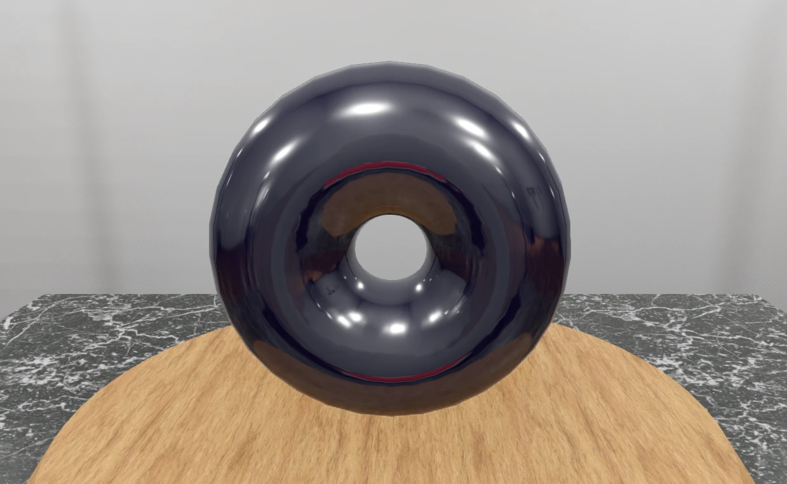
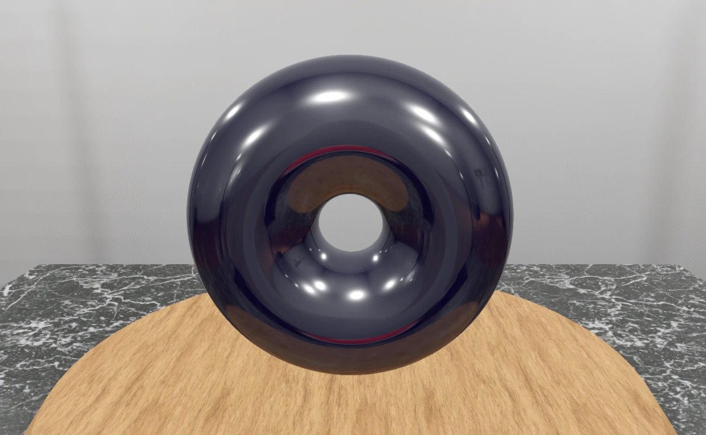

<style>
body {
	max-width: 60em;
	line-height: 150%;
	font-family: sans-serif;
	padding: 1em;
	margin: 0 auto;
}
img, video {
	width: 100%;
	max-width: 512px;
}
iframe {
	width: 100%;
	height: 38em;
}
pre {
	border: 1px solid black;
	padding: 1em 2em;
}
/* dark mode */
@media (prefers-color-scheme: dark) {
	body {
		color: #cac5be;
		background-color: #181a1b;
	}
	pre {
		border: 1px solid white;
	}
	h1, h2, h3, h4, h5 {
		border-color: rgba(255, 255, 255, 0.48) !important;
	}
	a {
		color: #6eb2ee;
	}
}
</style>

# Project 4 - It belongs in a Museum!

A museum that features four interactive exhibits, each focused on one of the following topics:

- Image-based rendering
- Materials (using a fragment shader)
- Animated geometry (using a vertex shader)
- Volumetric rendering

> The project was initially developed using Godots `Forward+` rendering backend. Every screenshot and recording on this page is done using this backend. Later, the rendering backend was changed to `Compatibility` to create a web export. All exhibits still work the same, but the visual quality of the scene is reduced (disabled rendering features, reduced number of lights, disabled shadows).

## Walkthrough Video

TODO

## Binaries (`Forward+`)

TODO

## Interactive Web Version (`Compatibility`, reduced visual Quality)

TODO

## Exhibit 1: SDF (Image-based Rendering)

<video alt="Recording of an SDF that transforms from a torus to a mug and back" autoplay loop controls>
<source src="videos/1_sdf.webm">
</video>

> Relevant folder in the Godot project: `_sdf`.

The first exhibit is an object defined by a signed distance field (SDF) and rendered using ray marching. It interacts with the rest of the scene, which is rendered using conventional methods. The presented approach can also be used to implement other ray tracing techniques.

Image-based rendering describes rendering using bitmap images that encode scene content. Image-based techniques are used in two ways here:

- The depth map is read to determine occlusion by other objects.
- A reflection probe is used to render reflections of the surrounding scene.

The morphing between shapes shows how a cheap effect like reflection mapping can be made to look good.

### How it works

Since ray marching is used, a form of ray tracing, the shape and shading of the object is entirely defined in the fragment shader. Typically, with ray tracing, calculations happen for every pixel of the resulting image. Following this, it would be possible to implement it as a fullscreen post-processing effect. Every fragment, in which the ray does not hit the object or is behind already drawn geometry, can be discarded:

```GLSL
vec3 normal; vec3 hit_pos;
bool hit = sphere_trace_ray(ray, local, normal, hit_pos);
if (!hit) { discard; }
```

However, it is also possible to implement this in the fragment shader of a normal mesh instead of as a fullscreen effect. The only limitation is that we cannot render anything outside the mesh, so the mesh is effectively a bounding shape for the object. This has performance advantages:

- Pixels outside the mesh do not get drawn.
- If the mesh is outside the view of the camera, the object does not get rendered at all, thanks to Godots occlusion culling.

The images below show the edges of the mesh in orange. On the left image, the mesh is not big enough to contain the object.



Note that the culling mode must be changed to front face culling, so only front faces are drawn. Otherwise, the object is not rendered when the camera is inside the mesh.

For a better integration into Godot, the projection matrix, view matrix and model matrix are used for ray generation:

```GLSL
float depth = texture(depth_texture, SCREEN_UV).x;
// This assumes the use of the Forward+ or Mobile renderers
vec3 ndc = vec3(SCREEN_UV * 2.0 - 1.0, depth);
// Use this for the compatibility renderer
//vec3 ndc = vec3(SCREEN_UV, depth) * 2.0 - 1.0;
vec4 world = INV_VIEW_MATRIX * INV_PROJECTION_MATRIX * vec4(ndc, 1.0);
vec3 world_depth_map_pos = world.xyz / world.w;

mat4 inv_model_matrix = inverse(MODEL_MATRIX);
vec3 local_depth_map_pos = (inv_model_matrix * vec4(world_depth_map_pos, 1.0)).xyz;
vec3 local_cam_pos = (inv_model_matrix * vec4(CAMERA_POSITION_WORLD, 1.0)).xyz;
Ray ray = Ray(local_cam_pos, normalize(local_depth_map_pos - local_cam_pos));
```

This way, the object is also visible in the editor and respects the transform of the corresponding `MeshInstance3D`. Ray marching is done in its local space. Therefore, SDFs can be transformed like any other 3D objects.

Godots default lighting is used. The `NORMAL` and `LIGHT_VERTEX` variables are set in `fragment()` to ensure the lighting and reflection mapping is correct:

```GLSL
vec3 world_normal = normalize(mat3(MODEL_MATRIX) * local_normal);
NORMAL = mat3(VIEW_MATRIX) * world_normal;
vec4 world_hit_pos = MODEL_MATRIX * vec4(local_hit_pos, 1.0);
LIGHT_VERTEX = (VIEW_MATRIX * world_hit_pos).xyz;
```

### Comparison to Rasterization

Torus rendered using rasterization:



Torus rendered using ray marching:



In the rasterized torus, you can make out the vertices and edges of the mesh in the reflections. The ray marched torus has perfect reflections.

### Potential Extension: Recursive Ray Tracing

In principle, it would be possible to implement the recursive ray tracing algorithm using this approach: Whenever the ray does not hit the object anymore, the reflection map is sampled. However, this is currently difficult to implement in Godot, since Godot does not provide any way to access the reflection map of a reflection probe.

### What about Shadows and Multiple SDFs?

The final piece of the puzzle for feature parity with conventional meshes is shadows and correct rendering of multiple intersecting objects.

With the current implementation, the shader reads the depth map. This means that the object is rendered after the opaque render pass and cannot write to the depth map. This is similar to the way transparent objects are handled and leads to the same limitations: If multiple objects intersect, the result is wrong and shadows are not possible.

Alternatively, the SDF can be rendered as part of the opaque rendering pass by writing the correct depth to the `DEPTH` variable. This way the depth map does not need to be sampled manually and multiple SDF intersection is possible. Even though we write to the `DEPTH`, the rendering of the shadow map does not seem to take that into account. Instead, it uses the fragments position to calculate the depth, resulting in incorrect shadows. It seems this is a limitation of Godots shadow mapping implementation.

## Exhibit 2: Lenticular Card (Materials)

> Relevant folder in the Godot project: `_lenticular`.

## Exhibit 3: Fur with Physics (Animated Geometry)

> Relevant folder in the Godot project: `_fur`.

## Exhibit 4: Crepuscular Rays (Volumetric Rendering)

> Relevant folder in the Godot project: `_crepuscular_rays`.
