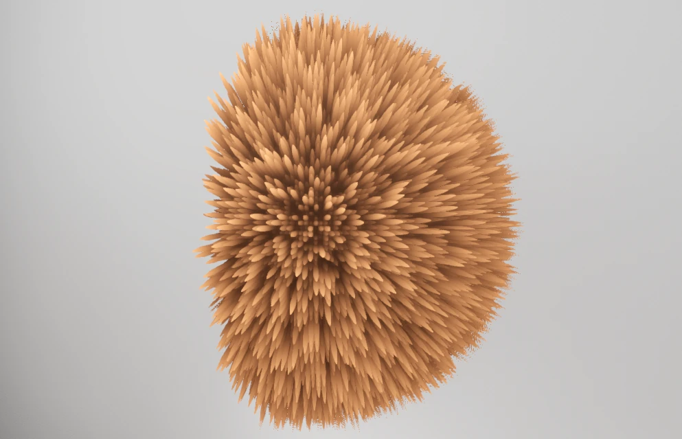

<style>
body {
	max-width: 60em;
	line-height: 150%;
	font-family: sans-serif;
	padding: 1em;
	margin: 0 auto;
}
img, video {
	width: 100%;
	max-width: 512px;
}
iframe {
	width: 100%;
	height: 38em;
}
pre {
	border: 1px solid black;
	padding: 1em 2em;
}
/* dark mode */
@media (prefers-color-scheme: dark) {
	body {
		color: #cac5be;
		background-color: #181a1b;
	}
	pre {
		border: 1px solid white;
	}
	h1, h2, h3, h4, h5 {
		border-color: rgba(255, 255, 255, 0.48) !important;
	}
	a {
		color: #6eb2ee;
	}
}
</style>

# Project 4 - It belongs in a Museum!

A museum that features four interactive exhibits, each focused on one of the following topics:

- Image-based rendering
- Materials (using a fragment shader)
- Animated geometry (using a vertex shader)
- Volumetric rendering

> The project was initially developed using Godots `Forward+` rendering backend. Every screenshot and recording on this page is done using this backend. Later, the rendering backend was changed to `Compatibility` to create a web export. All exhibits still work the same, but the visual quality of the scene is reduced (disabled rendering features, reduced number of lights, disabled shadows).

## Walkthrough Video

TODO

## Binaries (`Forward+`)

[Linux](../export/linux.tar.xz)

[Windows](../export/windows.7z)

## Interactive Web Version (`Compatibility`, reduced visual Quality)

TODO

## Exhibit 1: SDF (Image-based Rendering)

<video alt="Recording of an SDF that transforms from a torus to a mug and back" autoplay loop controls>
<source src="videos/sdf.webm">
</video>

> Relevant folder in the Godot project: `res://_sdf`.

The first exhibit is an object defined by a signed distance field (SDF) and rendered using ray marching. It interacts with the rest of the scene, which is rendered using conventional methods. The presented approach can also be used to implement other ray tracing techniques.

Image-based rendering describes rendering using bitmap images that encode scene content. Image-based techniques are used in two ways here:

- The depth map is read to determine occlusion by other objects.
- A reflection probe is used to render reflections of the surrounding scene.

The morphing between shapes shows how a cheap effect like reflection mapping can be made to look good.

### How it works

Since ray marching is used, a form of ray tracing, the shape and shading of the object is entirely defined in the fragment shader. Typically, with ray tracing, calculations happen for every pixel of the resulting image. Following this, it would be possible to implement it as a fullscreen post-processing effect. Every fragment, in which the ray does not hit the object or is behind already drawn geometry, can be discarded:

```GLSL
vec3 normal; vec3 hit_pos;
bool hit = sphere_trace_ray(ray, local, normal, hit_pos);
if (!hit) { discard; }
```

However, it is also possible to implement this in the fragment shader of a normal mesh instead of as a fullscreen effect. The only limitation is that we cannot render anything outside the mesh, so the mesh is effectively a bounding shape for the object. This has performance advantages:

- Pixels outside the mesh do not get drawn.
- If the mesh is outside the view of the camera, the object does not get rendered at all, thanks to Godots occlusion culling.

The images below show the edges of the mesh in orange. On the left image, the mesh is not big enough to contain the object.


Note that the culling mode must be changed to front face culling, so only front faces are drawn. Otherwise, the object is not rendered when the camera is inside the mesh.

For a better integration into Godot, the projection matrix, view matrix and model matrix are used for ray generation:

```GLSL
float depth = texture(depth_texture, SCREEN_UV).x;
// This assumes the use of the Forward+ or Mobile renderers
vec3 ndc = vec3(SCREEN_UV * 2.0 - 1.0, depth);
// Use this for the compatibility renderer
//vec3 ndc = vec3(SCREEN_UV, depth) * 2.0 - 1.0;
vec4 world = INV_VIEW_MATRIX * INV_PROJECTION_MATRIX * vec4(ndc, 1.0);
vec3 world_depth_map_pos = world.xyz / world.w;

mat4 inv_model_matrix = inverse(MODEL_MATRIX);
vec3 local_depth_map_pos = (inv_model_matrix * vec4(world_depth_map_pos, 1.0)).xyz;
vec3 local_cam_pos = (inv_model_matrix * vec4(CAMERA_POSITION_WORLD, 1.0)).xyz;
Ray ray = Ray(local_cam_pos, normalize(local_depth_map_pos - local_cam_pos));
```

This way, the object is also visible in the editor and respects the transform of the corresponding `MeshInstance3D`. Ray marching is done in its local space. Therefore, SDFs can be transformed like any other 3D objects.

Godots default lighting is used. The `NORMAL` and `LIGHT_VERTEX` variables are set in `fragment()` to ensure the lighting and reflection mapping is correct:

```GLSL
vec3 world_normal = normalize(mat3(MODEL_MATRIX) * local_normal);
NORMAL = mat3(VIEW_MATRIX) * world_normal;
vec4 world_hit_pos = MODEL_MATRIX * vec4(local_hit_pos, 1.0);
LIGHT_VERTEX = (VIEW_MATRIX * world_hit_pos).xyz;
```

### Comparison to Rasterization

Torus rendered using rasterization:


Torus rendered using ray marching:


In the rasterized torus, you can make out the vertices and edges of the mesh in the reflections. The ray marched torus has perfect reflections.

### Potential Extension: Recursive Ray Tracing

In principle, it would be possible to implement the recursive ray tracing algorithm using this approach: Whenever the ray does not hit the object anymore, the reflection map is sampled. However, this is currently difficult to implement in Godot, since Godot does not provide any way to access the reflection map of a reflection probe.

### What about Shadows and Multiple SDFs?

The final piece of the puzzle for feature parity with conventional meshes is shadows and correct rendering of multiple intersecting objects.

With the current implementation, the shader reads the depth map. This means that the object is rendered after the opaque render pass and cannot write to the depth map. This is similar to the way transparent objects are handled and leads to the same limitations: If multiple objects intersect, the result is wrong and shadows are not possible.

Alternatively, the SDF can be rendered as part of the opaque rendering pass by writing the correct depth to the `DEPTH` variable. This way the depth map does not need to be sampled manually and multiple SDF intersection is possible. Even though we write to the `DEPTH`, the rendering of the shadow map does not seem to take that into account. Instead, it uses the fragments position to calculate the depth, resulting in incorrect shadows. It seems this is a limitation of Godots shadow mapping implementation.

## Exhibit 2: Lenticular Card (Materials)

<video alt="Recording of lenticular card that switches between two images" autoplay loop controls>
<source src="videos/lenticular_card.webm">
</video>

> Relevant folder in the Godot project: `res://_lenticular`.

The second exhibit is a lenticular print, aka "wiggle picture" or "tilt card". It also implements a time-based scrolling between two lenticular prints, similar to a scrolling billboard.

### Lenticular Printing (Materials)

Lenticular printing is a technique in which lenticular lenses are used to produce images with the ability to change as they are viewed from different angles. This can be used to create an illusion of depth.

Video showing some lenticular cards: https://youtu.be/CMOzFkbqst8

To create a lenticular print, multiple steps are necessary:

1. Multiple source images are collected.
2. An interlaced image is created from the source images.
3. A lenticular sheet is put on top of the interlaced image.

The refraction effect of a lenticular sheet is shown in this image:


source: https://en.wikipedia.org/wiki/Lenticular_printing#/media/File:Lenticular_printing_principle.svg; author: [Cmglee](https://commons.wikimedia.org/wiki/User:Cmglee); license: [CC BY-SA 4.0](https://creativecommons.org/licenses/by-sa/4.0)

### Implementation

When implementing, I followed the three steps described above.

First, I collected the source images that are used for the print. I used previous projects to take screenshots. I took 16 pictures each from slightly different angles. The pictures can be found in the Godot project under `res://_lenticular/animation_frames_crown` and `res://_lenticular/animation_frames_raytracing`.

After that, I implemented a shader that slices and interlaces these images, just as it is done in real life. In Godot, the images were created in the scene `res://_lenticular/interlaced_render.tscn`. There are two nodes for creating interlaced renders. One for the crown, one for the ray tracing image. If you check the `enable` option on one of those and run the scene, a `screenshot.png` will be created containing the lenticular print. This works by applying an unlit fullscreen shader (`res://_lenticular/interlaced.gdshader`), resizing the window to the desired resolution and capturing a screenshot. Note that these images could be printed and used for real life lenticular prints.

Lastly, the behaviour of a lenticular sheet is imitated with a shader (`res://_lenticular/lenticular.gdshader`). The shader reproduces the refraction effect of a lenticular sheet. Depending on the viewing angle, the interlaced image is sampled at a different location. Note that any interlaced image may be used as input for this shader. The shader is configurable for any number of source images and number of slices of the interlaced image.

### Lighting

To imitate the reflections of the lenticular sheet a normal map generated from a noise texture was used. It was stretched along the y texture coordinate to imitate the structure of a lenticular sheet.

### Time-based Offset

The billboard-like scrolling is implemented using an offset of the y texture coordinate following this function:


## Exhibit 3: Fur with Physics (Animated Geometry)

<video alt="Recording of three shapes with different fur bouncing around" autoplay loop controls>
<source src="videos/fur.webm">
</video>

> Relevant folder in the Godot project: `res://_fur`.

This exhibit shows 3 shapes with different kinds of fur. They are physically simulated and bounce around when the red button is pressed. The fur reacts to the movement. One of the shapes changes its size over time.

The fur is implemented using a technique called shell texturing. The fur is inspired by this video: https://youtu.be/9dr-tRQzij4

### Shell Texturing

Shell texturing creates the illusion of dense geometry from simple geometry. It can simulate dense hair or grass. Games like Dark Souls, Genshin Impact and Viva Piñata use it.

Shell texturing works by layering a simple flat mesh (the "shell") multiple times on top of another. More specifically, position of the meshes vertices are extrapolated in the normal direction:

```glsl
vec3 height_offset = v_height_normalized * u_length * NORMAL;
VERTEX += height_offset;
```

This image shows how a mesh of a half sphere is layered 16 times on top of another:


Then, a hash for all individual strands is calculated in the fragment shader. Based on this hash, fragments are discarded in a way that the illusion of individual strands is created:


After adding some more parameters to control the shape of the strands, the shading is calculated. For this a non-physically based lighting model (half lambert) is used:

```glsl
void light() {
	float n_dot_l = clamp(dot(NORMAL, LIGHT), 0.0, 1.0);
	// this is not physically correct at all, but it looks good.
	float lighting = n_dot_l * 0.5 + 0.5;
	lighting = lighting * lighting;
	DIFFUSE_LIGHT += lighting * ATTENUATION * v_ambient_occlusion * LIGHT_COLOR;
}
```

The `v_ambient_occlusion` is a fake ambient occlusion that is based on the distance to the most inner shell. Because this is constant per shell, it is calculated in the vertex shader.



### Physics

The physics simulation is done as two steps: Offset based on the position change and an offset based on the rotation change.

To simulate physics based on the position change, the shader takes a uniform `u_displacement_vector` that is calculated on the CPU each physics step. The shells are displaced based on their distance to the most inner shells and some parameters like hair curvature:

```glsl
// VERTEX has been transformed to world space
float k = pow(v_height_normalized, 1.0 + u_curvature);
vec3 physics_translation_offset = k * displacement_strength * u_displacement_vector;
VERTEX += physics_translation_offset;
```

A displacement vector of (0, -3, 0) results in the following:


To simulate physics based on rotation, the shader takes the `uniform mat3 u_rotation_displacement` that is also calculated on the CPU each physics step. This matrix represents a rotation in local space about the center of the node. The shells are displaced based on their distance to the most inner shell:

```glsl
float k = pow(v_height_normalized, 1.0 + u_curvature);
vec3 rot_vert = u_rotation_displacement * VERTEX;
VERTEX = mix(VERTEX, rot_vert, k);
```

This approach interpolates between the position of the rotated vertex and the non-rotated vertex. This is not a correct interpolation. To correctly interpolate between rotations, a quaternion is necessary. However, the incorrect approach also works good enough.

A rotation about the axis that is pointing towards the viewer looks like this:


The displacement vector and rotation matrix are calculated in the function `_physics_process` in the script `res://_fur/fur.gd`. After some finetuning, the hair physics look like this:

The implementation of the displacement vector (but not the rotation) is similar to the before mentioned video.

<video alt="Recording of hair physics in the editor" autoplay loop controls>
<source src="videos/fur_editor.webm">
</video>

### Scene Setup

To create an interesting exhibit, different shapes were created, their hair materials were adjusted and physics using Godots physics cababilities were configured. Also, a time-based growing/shrinking was implemented in the vertex shader, that is only active for one of the three shapes. The physics shape of that object is adjusted to match the growing/shrinking (`res://_fur/collusion_time_adjust.gd`).

## Exhibit 4: Crepuscular Rays (Volumetric Rendering)


> Relevant folder in the Godot project: `res://_crepuscular_rays`.

As the fourth exhibit, I implemented a post-processing technique for rendering crepuscular rays, following [this paper](https://developer.nvidia.com/gpugems/gpugems3/part-ii-light-and-shadows/chapter-13-volumetric-light-scattering-post-process).

The fog and shadows that are seen in the image above are created using Godots built in techniques (volumetric fog and shadow mapping).

### How it works

Typically, the first step is to do a occlusion pre-pass that renders all occluders as black:


However, we can skip this step by using one of the following tricks:

We can sample the screen textures alpha texture. It is 0 where no object was rendered. In the configured scene this is only at the window. However, this only works when screen space reflections (SSR) are disabled.

```glsl
float light = 1.0 - texture(screen_texture, uv).a;
```

A more robust approach is to sample the depth map. It is >0 where objects were rendered, which works also with SSR enabled.

```glsl
float light = float(texture(depth_texture, uv).r <= 0.0);
```

Now, we calculate the screen space position of the light source:

```glsl
vec4 light_pos_ndc = PROJECTION_MATRIX * VIEW_MATRIX * vec4(light_position_world, 1);
light_pos_ndc /= light_pos_ndc.w;
light_position_screen = (light_pos_ndc.xy * 0.5 + 0.5);
```

This is done in the vertex shader as it does not differ between fragments. It could also be done on CPU.

Now we take multiple samples and sum them, starting at the screen space light position and stepping towards the screen space fragment position. Successive samples are scaled by the `weight` and `decay` constants. `decay` is reduced each sample by multiplying by itself. The complete algorithm:

```glsl
void fragment() {
	vec2 delta_uv = SCREEN_UV - light_position_screen;
	delta_uv /= float(NUM_SAMPLES);

	vec2 uv = SCREEN_UV;
	float acc_light = 0.0;
	float current_decay = 1.0;
	for (int i = 0; i < NUM_SAMPLES; i++) {
		float light = float(texture(depth_texture, uv).r <= 0.0);

		light *= current_decay * weight;
		acc_light += light;
		current_decay *= decay;

		uv -= delta_uv;
		if (uv.x > 1.0 || uv.x < 0.0 || uv.y > 1.0 || uv.y < 0.0) {
			break;
		}
	}

	ALBEDO.xyz = vec3(acc_light);
}
```

Using a sample count of 128 we can achieve the following result:


Finally, we add the result to our image by specifying the `render_mode blend_add` (left: default scene, right: scene with crepuscular rays):


